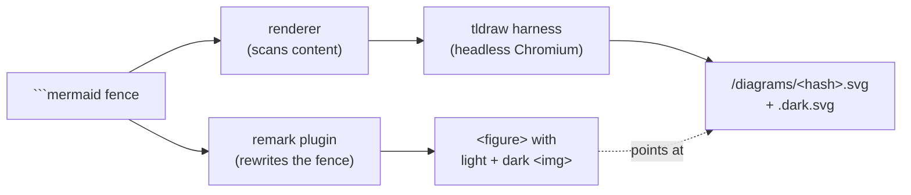

# remark-mermaid-tldraw — detailed guide

This is the long version. For install and a five-minute setup, see the [README](./README.md). Here we cover the architecture, the caching/versioning model, framework wiring recipes, CI, performance, and troubleshooting.

## Architecture

Three parts cooperate. The first runs inside your markdown pipeline; the other two run as a build step.



### 1. The remark plugin (`remark.ts`)

A standard [unified](https://unifiedjs.com)/remark transformer. It visits every `code` node, and for each one whose `lang` is `mermaid` it:

- hashes the source with `hashMermaid` (see [Caching](#the-caching-and-versioning-model)),
- parses fence meta (`width=…`) into a `style="max-width:…"`,
- replaces the node with an `html` node: a `<figure class="mermaid-diagram not-prose">` holding two ``s — `.mermaid-light` → `/diagrams/<hash>.svg`, `.mermaid-dark` → `/diagrams/<hash>.dark.svg`, both `loading="lazy" decoding="async"`.

It does not render anything. It only rewrites markdown and trusts that an SVG with that filename will exist at serve time.

### 2. The renderer (`render.ts`)

`renderDiagrams(options)` is the workhorse:

1. **Collect.** Glob the content, parse each file with `mdast-util-from-markdown`, pull out every mermaid block, dedupe by hash. (Two posts with the identical diagram render once.)
2. **Decide what's pending.** For each hash, check whether both `<hash>.svg` and `<hash>.dark.svg` exist *and* carry the current render marker. Up-to-date ones are skipped.
3. **Render the rest.** Only if something is pending: spin up a Vite dev server rooted at the shipped `harness/`, launch headless Chromium with Playwright, load the harness page, and call `window.renderMermaid(source, { padding })` once per diagram. Write `<marker>\n<svg>` for each variant.
4. **Report.** Return `{ total, rendered }`.

`pruneOrphans(options)` is the GC half: it lists the outDir and deletes any `.svg` whose hash no diagram references. It's deliberately *not* part of a normal render (see [caveats](#why-orphans-arent-pruned-automatically)).

### 3. The tldraw harness (`harness/harness.tsx` + `harness.html`)

A tiny client app served by the transient Vite server. It mounts a real `<Tldraw>` editor, stashes it on `window.__tldrawEditor`, preloads fonts, and exposes `window.renderMermaid`. For each call it:

- clears the page,
- runs `@tldraw/mermaid`'s `createMermaidDiagram(editor, source, …)`,
- exports the resulting shapes twice with `editor.getSvgString(ids, { padding, background: false, darkMode })` — once light, once dark,
- returns `{ light, dark }` as SVG strings.

The renderer reaches into the page with `page.evaluate` to drive this. The harness ships as **raw source** under `<pkg>/harness` (it's in the package `files`), because Vite compiles it on the fly — it is never bundled into `dist`.

#### The font-preload gotcha

tldraw sizes text shapes by **measuring them in the DOM**. If the `tldraw_draw` web font hasn't loaded by the time `createMermaidDiagram` runs, labels get measured against a fallback font, land in boxes that are too small, and then the real font wraps and clips them once it arrives. The harness fixes this by dropping a probe text shape for each tldraw font (`draw`, `sans`, `serif`, `mono`), awaiting `editor.fonts.loadRequiredFontsForCurrentPage()` and `document.fonts.ready`, then deleting the probes — all before the first render. This is why labels come out crisp instead of clipped.

#### Unsupported diagram types

`createMermaidDiagram` is given an `onUnsupportedDiagram` callback. When tldraw can't model a diagram natively (pie, gantt, class, ER, state, …), mermaid's own SVG is handed back, and the harness drops it onto the canvas via `editor.putExternalContent({ type: "svg-text", … })`. You still get a real, themed diagram in the same pipeline — it just won't have the hand-drawn tldraw look.

## The caching and versioning model

Two independent processes — the remark plugin and the renderer — have to agree on a filename without ever sharing state. The trick is to make the filename a pure function of the diagram source, and to track render-logic changes separately, inside the file.

### Filenames: hash by source only

```
hashMermaid(source) = sha256(source.replace(/\r\n/g, "\n").trim()).slice(0, 16)
```

The hash depends on **nothing but the trimmed diagram text**. Not the tldraw version, not the padding, not the render logic. That's deliberate:

- The plugin and renderer both call `hashMermaid` on the same fenced source, so they always compute the same URL — no manifest, no lookup table, no build-order coupling.
- The URL is stable across render-logic changes, which matters because frameworks cache rendered content. If the URL changed every time you bumped tldraw, a stale framework cache would point at a filename that no longer exists, and you'd get 404s.

### Invalidation: a version marker inside the file

Filenames can't encode "the render logic changed" without also changing the URL. So that signal lives *inside* each SVG instead — the first line of every rendered file is:

```
<!-- remark-mermaid-tldraw render:tldraw-5.1.1-r1 -->
```

`RENDER_VERSION` (in `shared.ts`) is that string. On each run the renderer treats a diagram as up-to-date only if both variants exist **and** contain the current marker. So:

| change | what happens | URL |
|--------|--------------|-----|
| diagram source edited | hash changes → file is missing → render | **new** URL |
| render logic / tldraw bumped (marker bumped) | marker stale → re-render **in place** | same URL |
| nothing changed | both variants present + current marker → skip | same URL |

### When to bump `RENDER_VERSION`

Bump it whenever the **visual output** of a render should change for the *same* source: a new tldraw version with a different look, a change to the export options, a harness tweak. After bumping, the next render re-writes every diagram in place (same filenames). If you don't bump it, existing SVGs are considered current and won't be re-rendered even though the logic changed.

If you just want to force a one-off re-render without editing source, delete the outDir (or run `--clean`, which prunes orphans first).

### Why orphans aren't pruned automatically

When you delete or edit a diagram, its old hash-named SVG becomes an orphan. A normal render leaves it alone, because a framework's content render cache might still reference the old URL during an incremental build — deleting it would 404 the page mid-build. Prune explicitly with `--clean` (CLI) or `pruneOrphans()` (programmatic) once you know the cache is clear, e.g. on a clean CI build.

## Wiring recipes

The remark plugin is framework-agnostic — anywhere you can pass `remarkPlugins`, it works. The only per-framework question is *where the render step runs*.

### Astro

Use the integration; it renders on `config:setup` (before dev and build) and watches content in dev, forcing a reload when a diagram changes.

```js
// astro.config.mjs
import { defineConfig } from "astro/config";
import remarkMermaidTldraw from "remark-mermaid-tldraw";
import { mermaidTldraw } from "remark-mermaid-tldraw/astro";

export default defineConfig({
  integrations: [mermaidTldraw({ content: ["src/content/**/*.{md,mdx}"] })],
  markdown: { remarkPlugins: [remarkMermaidTldraw] },
});
```

`mermaidTldraw()` takes the same `RenderOptions` as the CLI/`renderDiagrams`. Default `outDir` is `public/diagrams`, served by Astro at `/diagrams` — which matches the plugin's default `publicPrefix`.

### Next.js — `@next/mdx`

Add the remark plugin in `next.config.mjs`, and run the renderer as a prebuild step.

```js
// next.config.mjs
import createMDX from "@next/mdx";
import remarkMermaidTldraw from "remark-mermaid-tldraw";

const withMDX = createMDX({ options: { remarkPlugins: [remarkMermaidTldraw] } });
export default withMDX({ pageExtensions: ["ts", "tsx", "md", "mdx"] });
```

```jsonc
// package.json — SVGs land in public/diagrams, served at /diagrams
{
  "scripts": {
    "prebuild": "remark-mermaid-tldraw --content \"{app,content,src}/**/*.{md,mdx}\" --out public/diagrams",
    "build": "next build"
  }
}
```

`next dev` doesn't run `prebuild`, so either run the CLI with `--watch` in a second terminal during development, or `npm run prebuild` once before `next dev`.

### Next.js — `next-mdx-remote`

`next-mdx-remote` compiles MDX at request/build time; pass the plugin in its options and keep the same prebuild render step.

```tsx
import { compileMDX } from "next-mdx-remote/rsc";
import remarkMermaidTldraw from "remark-mermaid-tldraw";

const { content } = await compileMDX({
  source,
  options: { mdxOptions: { remarkPlugins: [remarkMermaidTldraw] } },
});
```

The renderer scans the raw markdown/MDX files (not the rendered output), so point `--content` at wherever those source files live, and serve `--out` from `public/diagrams`.

### Vite + `@mdx-js/rollup`

```js
// vite.config.js
import { defineConfig } from "vite";
import mdx from "@mdx-js/rollup";
import remarkMermaidTldraw from "remark-mermaid-tldraw";

export default defineConfig({
  plugins: [mdx({ remarkPlugins: [remarkMermaidTldraw] })],
});
```

Render into Vite's static dir (`public/diagrams`, served at `/diagrams`):

```jsonc
{
  "scripts": {
    "predev": "remark-mermaid-tldraw --content \"src/**/*.{md,mdx}\"",
    "prebuild": "remark-mermaid-tldraw --content \"src/**/*.{md,mdx}\""
  }
}
```

Or invoke `renderDiagrams()` from a small Vite plugin's `buildStart`/`configureServer` hook if you'd rather not shell out.

### React Router 7 / Remix (MDX)

Add the plugin to your MDX config (e.g. `@mdx-js/rollup` in `vite.config`, same as above), and run the CLI as a prebuild step writing into `public/diagrams`. React Router serves `public/` at the root, so the default `/diagrams` prefix just works.

### Eleventy and other markdown pipelines

Anything that exposes `remarkPlugins` can use the plugin; anything that doesn't can still use the renderer to produce SVGs, then reference them however you like. The plugin and renderer only need to agree on `publicPrefix` ↔ `outDir`.

## Running in CI

The render step needs Chromium. Install it before building, and cache it so you're not re-downloading on every run.

```yaml
# .github/workflows/build.yml
name: build
on: [push]
jobs:
  build:
    runs-on: ubuntu-latest
    steps:
      - uses: actions/checkout@v4
      - uses: actions/setup-node@v4
        with: { node-version: 20, cache: npm }
      - run: npm ci

      - name: Cache Playwright browsers
        uses: actions/cache@v4
        with:
          path: ~/.cache/ms-playwright
          key: playwright-${{ runner.os }}-${{ hashFiles('package-lock.json') }}

      - run: npx playwright install --with-deps chromium
      - run: npm run build   # prebuild renders the diagrams, then the framework builds
```

Notes:

- `--with-deps` pulls the system libraries headless Chromium needs on a fresh Ubuntu runner. On other distros, install equivalents.
- If you **commit your SVGs**, CI doesn't need Chromium at all on builds where nothing changed — the renderer skips everything and never launches the browser. Install Chromium anyway so the one build that *does* have a new diagram can render it.
- Use `--clean` in CI if you want orphaned SVGs pruned on each build (safe on a clean checkout).

## Performance notes

- **The browser launches only when something is pending.** A build where every diagram is already current pays nothing beyond globbing files and reading a marker line from each SVG.
- **Renders are serial.** One tldraw page renders every pending diagram in sequence, reusing the same editor and the same warmed-up fonts. This is intentionally simple and avoids font/measurement races; throughput is dominated by per-diagram layout, not browser startup (which is paid once).
- **Dedup is by source hash**, so a diagram repeated across many pages renders once.
- **Vite `optimizeDeps`** pre-bundles `react`, `react-dom/client`, `tldraw`, and `@tldraw/mermaid` so the first page load in the harness is quick.

## Troubleshooting

**Labels are clipped / text overflows its box.**
Almost always a font-loading race. The harness preloads tldraw's fonts before rendering (see [the gotcha](#the-font-preload-gotcha)); if you've modified the harness, make sure `loadRequiredFontsForCurrentPage()` and `document.fonts.ready` are still awaited before the first `createMermaidDiagram`. On a very slow CI box, bump `mountTimeout`.

**Blank or empty SVG, or "mermaid produced no shapes".**
The mermaid source didn't produce any shapes. Check the diagram parses in the [mermaid live editor](https://mermaid.live) first. The renderer logs harness `pageerror`/`console.error` lines — look there for a parse error from `@tldraw/mermaid`.

**My diagram doesn't look hand-drawn.**
It's an unsupported type (pie, gantt, class, ER, state, …) that fell back to mermaid's own SVG. That's expected — those render via `onUnsupportedDiagram`. Flowcharts, sequence, and the other tldraw-native types get the hand-drawn look.

**I changed tldraw / the render logic but the SVGs didn't update.**
Existing files still carry the old marker but are considered current until you bump `RENDER_VERSION`, or you blow away the outDir. Bump `RENDER_VERSION` (re-renders in place, same URLs) or run with `--clean` / delete `outDir` to force a full re-render.

**A diagram I deleted still shows up as a file.**
Orphans aren't auto-pruned (see [why](#why-orphans-arent-pruned-automatically)). Run `remark-mermaid-tldraw --clean` or call `pruneOrphans()`.

**404s on `/diagrams/<hash>.svg`.**
`publicPrefix` (plugin) and `outDir` (renderer) are out of sync, or the render step didn't run before serving. Confirm the SVGs exist in `outDir`, that `outDir` is under your framework's static root, and that the prefix matches the served path. The defaults (`/diagrams` ↔ `public/diagrams`) line up out of the box.

**"vite did not report a local url" or the harness never mounts.**
The transient Vite server or the tldraw editor failed to come up. Re-check that the peer deps (`tldraw`, `@tldraw/mermaid`, `react`, `react-dom`, `playwright`) are installed and that `npx playwright install chromium` has been run. Increase `mountTimeout` on slow machines.
