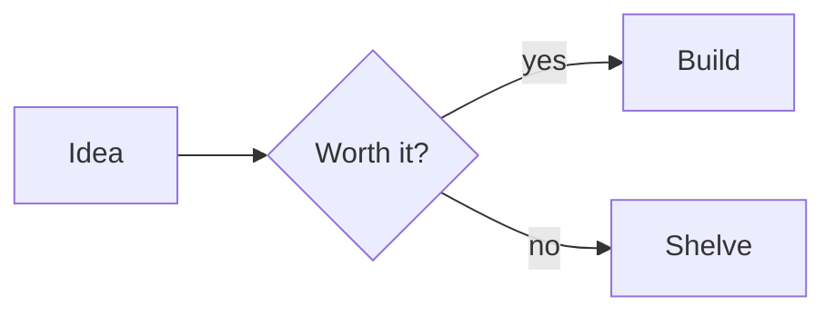
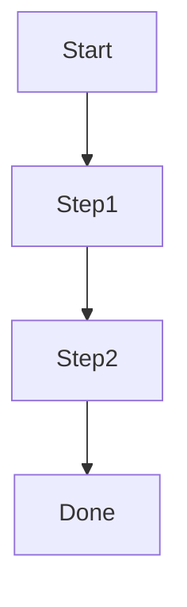

# remark-mermaid-tldraw

**Render mermaid diagrams as tldraw's hand-drawn SVGs, at build time.** A remark plugin rewrites your ```` ```mermaid ```` fences; a headless renderer turns each one into a pair of light/dark, transparent SVGs using a real [tldraw](https://tldraw.com) editor. Zero client JS, no runtime mermaid — just two `` tags per diagram.

[npm](https://www.npmjs.com/package/remark-mermaid-tldraw) · [GitHub](https://github.com/seangeng/remark-mermaid-tldraw) · [detailed guide](./GUIDE.md)

Mermaid's default output is fine, but it's flat — boxes, straight lines, a stock look. tldraw renders the same graph definition in its warm, hand-drawn style, and because it happens during your build, the visitor never downloads mermaid or runs a layout pass. They get an SVG.

> This generalizes [Sunil Pai's](https://github.com/threepointone) Astro mermaid + tldraw plugin (which he shared on X and in his repo) into a framework-agnostic package, and stands on [`@tldraw/mermaid`](https://www.npmjs.com/package/@tldraw/mermaid).

## Install

```bash
npm i -D remark-mermaid-tldraw tldraw @tldraw/mermaid playwright react react-dom
npx playwright install chromium
```

`tldraw`, `@tldraw/mermaid`, `playwright`, `react`, and `react-dom` are **peer dependencies** — the renderer drives a real tldraw editor in headless Chromium, so you bring the browser and the React/tldraw stack. (`vite`, `@vitejs/plugin-react`, `tinyglobby`, `unist-util-visit`, and `mdast-util-from-markdown` ship as regular deps.)

## Quick start

There are four pieces. The first three you do once; the fourth is every diagram.

### 1. Add the remark plugin

It rewrites each ```` ```mermaid ```` fence into a `<figure>` with a light and a dark ``. Wire it into whatever turns your markdown/MDX into HTML.

```js
// e.g. a Vite + @mdx-js/rollup config
import mdx from "@mdx-js/rollup";
import remarkMermaidTldraw from "remark-mermaid-tldraw";

export default {
  plugins: [
    mdx({ remarkPlugins: [remarkMermaidTldraw] }),
  ],
};
```

### 2. Add the render step

The plugin only points at SVGs — something has to produce them. Pick one:

**CLI prebuild** (works with any framework). Scan your content, write the SVGs, then build:

```jsonc
// package.json
{
  "scripts": {
    "prebuild": "remark-mermaid-tldraw --content \"src/**/*.{md,mdx}\" --out public/diagrams",
    "build": "..."
  }
}
```

**Astro integration** (auto-renders on `config:setup`, watches in dev):

```js
// astro.config.mjs
import { defineConfig } from "astro/config";
import remarkMermaidTldraw from "remark-mermaid-tldraw";
import { mermaidTldraw } from "remark-mermaid-tldraw/astro";

export default defineConfig({
  integrations: [mermaidTldraw()],
  markdown: { remarkPlugins: [remarkMermaidTldraw] },
});
```

### 3. Add the CSS

The light SVG shows by default; the dark one swaps in under a dark color scheme. You control the switch:

```css
.mermaid-dark { display: none; }
@media (prefers-color-scheme: dark) {
  .mermaid-light { display: none; }
  .mermaid-dark { display: inline; }
}
/* or, for a class-based theme:
   html.dark .mermaid-light { display: none; }
   html.dark .mermaid-dark  { display: inline; } */

.mermaid-diagram { margin: 1.5rem auto; }
.mermaid-diagram img { width: 100%; height: auto; }
```

### 4. Write a mermaid fence

````md

````

Cap a diagram's width with fence meta (handy for tall top-down flowcharts):

````md

````

## How it works

The two halves never talk directly — they agree on filenames.

1. **The remark plugin** hashes the fence's source (`sha256(trimmed).slice(0,16)`) and emits `.svg">` + `.dark.svg">`. The filename depends only on the diagram source.
2. **The renderer** scans the same content, hashes each block the same way, and — for anything not already rendered — boots a transient Vite dev server, opens a tldraw editor in headless Chromium, runs `@tldraw/mermaid`'s `createMermaidDiagram`, and exports the layout twice (light + dark theme, transparent background).

Because the URL is a pure function of the source, the plugin and renderer line up with **no shared manifest**. Caching works off a version marker written inside each SVG: change the diagram source and the filename changes (missing file → render); change the render logic and the marker goes stale (stale marker → re-render in place, same URL). **The browser only launches when something is actually pending.**

Diagram types tldraw can't model natively (pie, gantt, class, ER, …) fall back to mermaid's own SVG — still a real diagram, just not the hand-drawn aesthetic.

See [GUIDE.md](./GUIDE.md) for the full architecture, the caching model, framework recipes, CI setup, and troubleshooting.

## Options

### Remark plugin — `RemarkMermaidTldrawOptions`

```js
remarkPlugins: [[remarkMermaidTldraw, { publicPrefix: "/diagrams" }]]
```

| option | type | default | what it does |
|--------|------|---------|--------------|
| `publicPrefix` | `string` | `"/diagrams"` | URL prefix the SVGs are served from. Must match where the renderer writes them (a `public/diagrams` outDir is served at `/diagrams`). |
| `figureClassName` | `string` | `"mermaid-diagram"` | class on the wrapping `<figure>` |
| `lightClassName` | `string` | `"mermaid-light"` | class on the light `` |
| `darkClassName` | `string` | `"mermaid-dark"` | class on the dark `` |
| `alt` | `string` | `"Diagram"` | `alt` text on both images |
| `notProse` | `boolean` | `true` | append `not-prose` to the figure class (keeps Tailwind Typography from restyling it) |
| `theme` | `"both" \| "light" \| "dark"` | `"both"` | which variants to emit. `"both"` ships a light and a dark `` to swap in CSS; on a single-theme site, emit just one so the browser never fetches the variant it can't show. |

### Renderer — `RenderOptions`

Passed to `renderDiagrams()`, the Astro integration, and (a subset) the CLI.

| option | type | default | what it does |
|--------|------|---------|--------------|
| `content` | `string \| string[]` | `["src/**/*.md", "src/**/*.mdx"]` | globs to scan for mermaid blocks |
| `cwd` | `string` | `process.cwd()` | directory globs resolve against |
| `outDir` | `string` | `"public/diagrams"` | where SVGs are written |
| `padding` | `number` | `16` | padding (px) around the shapes in the exported SVG |
| `log` | `(message: string) => void` | `console.log` | log callback |
| `mountTimeout` | `number` | `30000` | ms to wait for the tldraw editor to mount |

`renderDiagrams()` returns `{ total, rendered }` — the number of distinct diagrams found, and how many were (re)rendered this run.

## CLI

```
remark-mermaid-tldraw [render] [options]

  -c, --content <glob>   markdown/MDX glob to scan (repeatable)
                         default: src/**/*.md, src/**/*.mdx
  -o, --out <dir>        output directory for SVGs   (default: public/diagrams)
  -p, --padding <px>     padding around shapes in the SVG   (default: 16)
  -w, --watch            re-render on content changes
      --clean            prune SVGs no diagram references anymore, then render
  -h, --help             show this help
```

```bash
remark-mermaid-tldraw --content "src/content/**/*.md" --out public/diagrams
remark-mermaid-tldraw --watch
remark-mermaid-tldraw --clean
```

`render` is an optional verb; `remark-mermaid-tldraw` and `remark-mermaid-tldraw render` do the same thing.

## Fence meta

| meta | example | effect |
|------|---------|--------|
| `width` | ```` ```mermaid width=380 ```` | caps the figure's `max-width`. Bare numbers become px (`380` → `380px`); any CSS length passes through (`width=24rem`). |

## Caveats

- **Build-time only.** The renderer needs a browser. In CI, run `npx playwright install chromium` before building (see [GUIDE.md](./GUIDE.md#running-in-ci)).
- **Commit or generate the SVGs.** They live in `outDir` (default `public/diagrams`). Either commit them, or make rendering a prebuild step so they exist before the build runs. The Astro integration handles this for you.
- **Filenames are never auto-pruned** on a normal render — a framework's content cache can still point at an old filename, and deleting it would 404. Run `--clean` (or `pruneOrphans()`) when you want to GC stale SVGs.
- **Unsupported diagram types** (pie, gantt, class, ER, …) fall back to mermaid's own SVG, so they won't match the hand-drawn look.
- **Large diagrams** render fine but can produce big SVGs; cap their width with fence meta.

## Credits

- [Sunil Pai](https://github.com/threepointone) for the original Astro mermaid + tldraw idea this generalizes.
- [`@tldraw/mermaid`](https://www.npmjs.com/package/@tldraw/mermaid) and [tldraw](https://tldraw.com) for the rendering.
- [mermaid](https://mermaid.js.org) for the diagram language (and the fallback renderer).

## License

MIT © [Sean Geng](https://seangeng.com)
